## Video

<iframe width="1280" height="720" src="https://www.youtube.com/embed/dvdL-JowSeQ?ecver=1" frameborder="0" allowfullscreen></iframe>
## Project Summary

TeamKill is an Artificial Intelligence Malmo-based project developed for a single/multi-player Minecraft survival mini-game called “Falling Floor”. 
The AI agent tries to survive in this environment by using our combination of search and navigation algorithms. 

### Falling Floor
In this game, the players’ mission is to survive by running around the map while floors start to crumble beneath them. This zero-sum game requires players to be the last one standing in order to win the game. The players are not allowed to jump or do any other actions other than to run for survival and employ various tactics to survive longer than their opponents. The player's performance is calculated based on their survival time.

### Challenges and Goal
In order to be applicable for a real-time changing environment against human players, our approach is constrained to algorithms with quick runtime that produce good estimation of the best move possible in any situation. In this harsh environment, conventional best-move search algorithms will suffer due to their runtime, while quick search algorithms tend to suffer from short-sightedness. This project explores various algorithms, compares their performance in terms of algorithm runtime and agent survival time, and selects the best combination of algorithms that produce the best performance. It is different from traditional navigation algorithm because the map is changing really fast. It is using human-like thinking with advanced algorithms, so it has a chance to out-smart human players.

## Approaches

### Building the game:

Game rules:
We implement the game ourselves. The game is a survival game in Minecraft and the player tries to survive in the map as long as possible. During the game, each player walks inside a plain ground and each tile of the ground disappears 4 seconds after a player steps on it. Players have to keep moving in order to survive. 

Implementing the game:

We implement a special block that would be destroyed 10 seconds after something collided with it. However, the Minecraft API is limited, and does not have the function for delaying the destruction. To solve that problem, we implement a hashmap (dictionary) to store all the destructions and time spot. Then, we destroy the blocks after the time in the dictionary is 4 seconds earlier than the current time.

After creating the block, we design the map with 40 * 40 special block. To prevent the player going beyond the ground, we surround it with diamond blocks that is 10 units high. To make sure the player lose after it falls off the ground, we put 2 layers of lava underneath the ground.

(For more information about how the game works, please watch our video.)
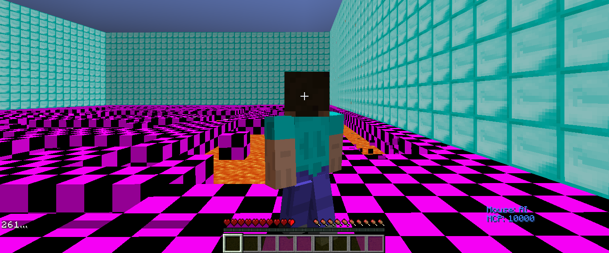{:class="img-responsive centered" height="40%"}

### Implementing the Artificial Intelligence:

Our artificial intelligence tries to survive in this floor falling game. It uses algorithms with three types of logics to find the best direction that it should go. The algorithm takes the input of all the map’s available ground location (as a matrix of 1 and 0) and the player location. The algorithm outputs the best direction the player should go in the next second.

The three types of logic that our algorithm has are ranked by complexity. Initially, the player will use the smartest logics which is really time-consuming. When the situation becomes more and more complex, the player will choose the algorithm that is simpler, but faster.

#### Three levels of smartness:

##### Level 1: Immediate decision
If the player is running out of time to think about his current situation, he will look up all the eight directions of his current location. He will count the number of tiles each direction can reach if he walks straight to that single direction for the rest of the game. Then, he will choose the direction with the longest path from the count.
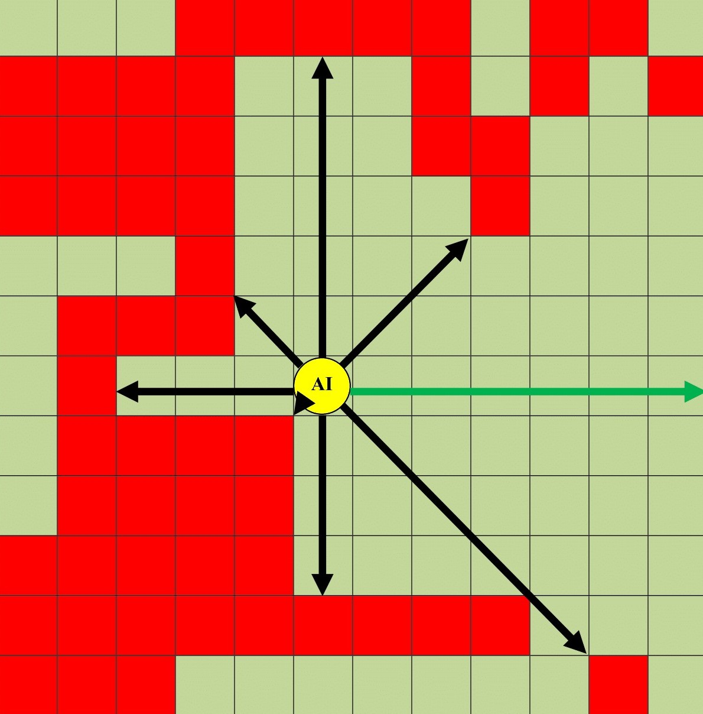{:class="img-responsive centered" height="40%" width="40%"}

##### Level 2: Two steps decision
If the player has more time, he will look around the eight adjacent tiles of him. For each tile, he will count the total length of the eight direction value in the previous algorithm as the score of that tile. Then, the player will move to the tile with the highest score.
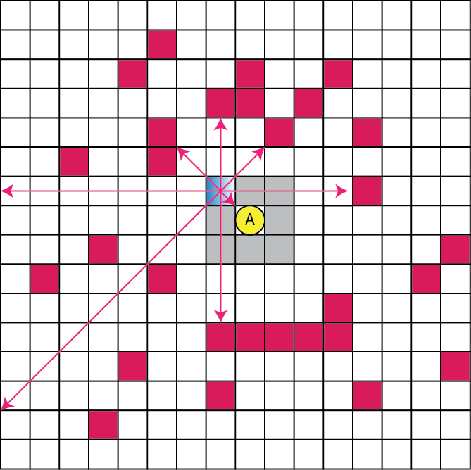{:class="img-responsive centered" height="40%" width="40%"}

##### Level 3: Navigating to best point
If the player still has some time, he will iterate through all the tiles in the map and find the tile that has the maximum possibility to survive. Then, he will navigate to that tile (output the first navigation direction).
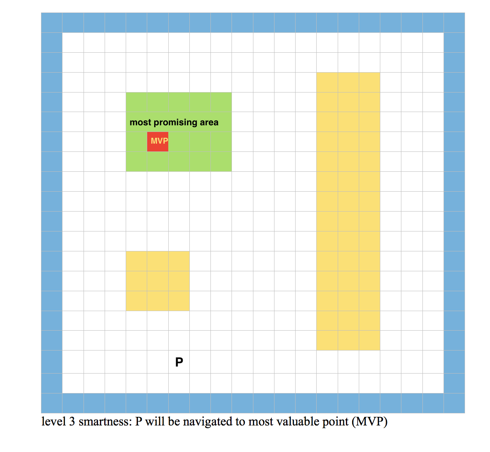{:class="img-responsive centered" height="40%" width="40%"}

More specifically about the third level of smartness, the player will select the tile with the maximum possibility to survive by using a new algorithm inspired by state transition machine.

#### Algorithm:

Comment: since each tile is represented by 1 in the input matrix and the missing tile is represented by 0, we tried to find the tile that surround by other tiles in the center.

1. Find all the tiles reachable by the player by using breadth first search.
2. For each tile reachable, add its surrounding tiles’ score to itself and output the new score to a new matrix. In that way, if a tile is surrounded by 8 tiles, it will have a higher score than the ones surrounded by 7 tiles.
3. Then, we repeat the first step 8 times so that each tile will be impacted by surrounding tiles with a diameter of 8.
4. We compare all the tiles score and find the tiles with the highest score. (There may be several of them)
5. We reassign each highest score tiles to be 1 and other tiles to be 0
6. We repeat step 2-5 until there are only 4 or fewer tiles remaining
7. We randomly select one of the remaining tiles and consider it as the tile with the highest possibility of survival.

After selecting the targeted tile, we use the Dijkstra’s algorithm to find the shortest path between the player and the targeted tile. Finally, we output the first step of that path.

### Improvement

After evaluating the previous combined version of our algorithm, we realize that the running time of navigating algorithm is too long. Sometimes, the agent gets a conflicting decision between level 2 and level 3 and it keeps switching because the running time is just at the limit. 

In order to help our AI decide which method to use, we added the navigation memory to our agent. The navigation memory records part of the previous navigation result. It remembers the next four steps the navigation will go after finding the route. If the next step is available the agent will just walk to that step instead of recalculating the navigation algorithm again.

To do that, we added a queue to our navigation system. The queue has a maximum length of 5 and it will be updated once the route is recalculated. Surprisingly, the navigation memory significantly reduces the average running time of our AI and keeps the majority of the decision to be navigating decision. The surviving time also increases significantly.

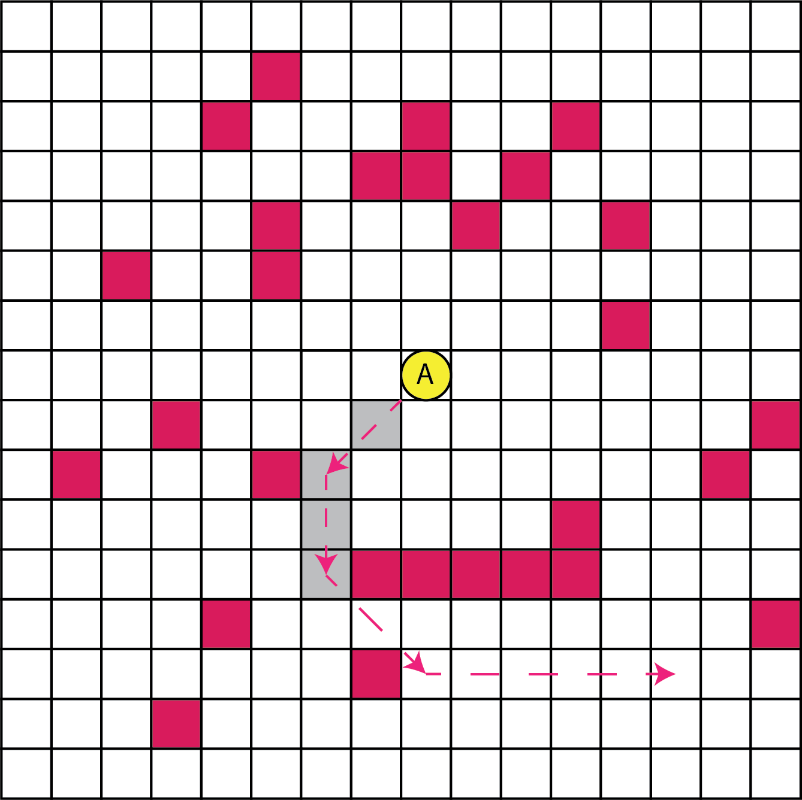{:class="img-responsive centered" height="40%" width="40%"}

Additionally we realize that a special occasion that our agent may die by going to the logical direction.

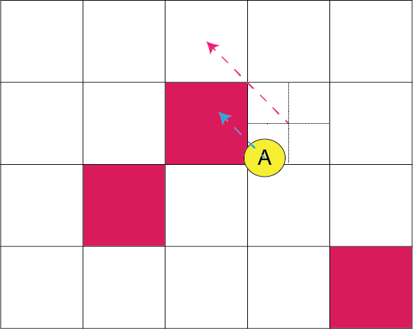{:class="img-responsive centered" height="40%" width="40%"}

In the above scenario, the player may want to go to the top left direction which is Okay if he stands on the middle of the grid. However, he is standing on the bottom left corner. If he walks to top left direction, he may end up going to the left tile first before going to the top left tile. If the left tile is dangerous, he may die with that mistake.

To solve that problem, we added a feature for eliminating the diagonal direction that may cause the player to death in those cases. We implemented it by splitting the player’s standing tile into four pieces and determine which piece the player is currently standing on. Then, we find the direction that may kill the player and remove it from our choices.

## Evaluation

#### Human thought
In order to show that our AI is great, we try to prove that it thinks like a human. Normally, when we play the ground falling game, we will go away from the enemy players and go toward the directions that have bigger lands. In our algorithm, smartness level 3 (navigation) is trying to simulate human’s thought. The AI will find the ground center that has the largest ability of expansion. The AI will then, navigate to that point.

Initially, the algorithm is really time-consuming and we provide the AI with simpler choices. At version 1, only when the situation is easier for the AI to do the human thought, will the AI do it. Usually, it happens when the AI is trapped on a small island with less than 100 tiles. If it uses the algorithm in a larger island, it will take more than 1 seconds to determine the next move. However, the AI usually moves 2-3 tiles each second, so it will die with that much delay. At that phase, we consider our AI to be: barely working.

In the second version, we significantly improve the running speed of our algorithm and enable it to calculate the whole map (1600 tiles) within 0.25 second in Python. At this phase, our AI can easily use the human logic and navigate to that direction.

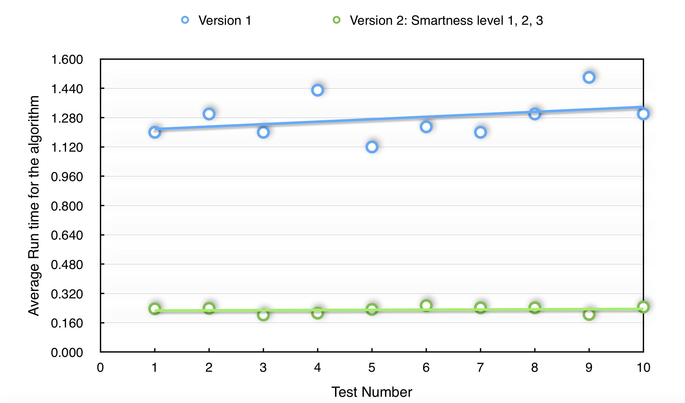{:class="img-responsive centered" height="80%" width="80%"}

In the third version, we, again, improved the running speed of our algorithm. We decrease the average running time to be less than 0.2 seconds in Python. With this improvement, we also increased the surviving time of the agent to be 4 times longer than the previous version.
 
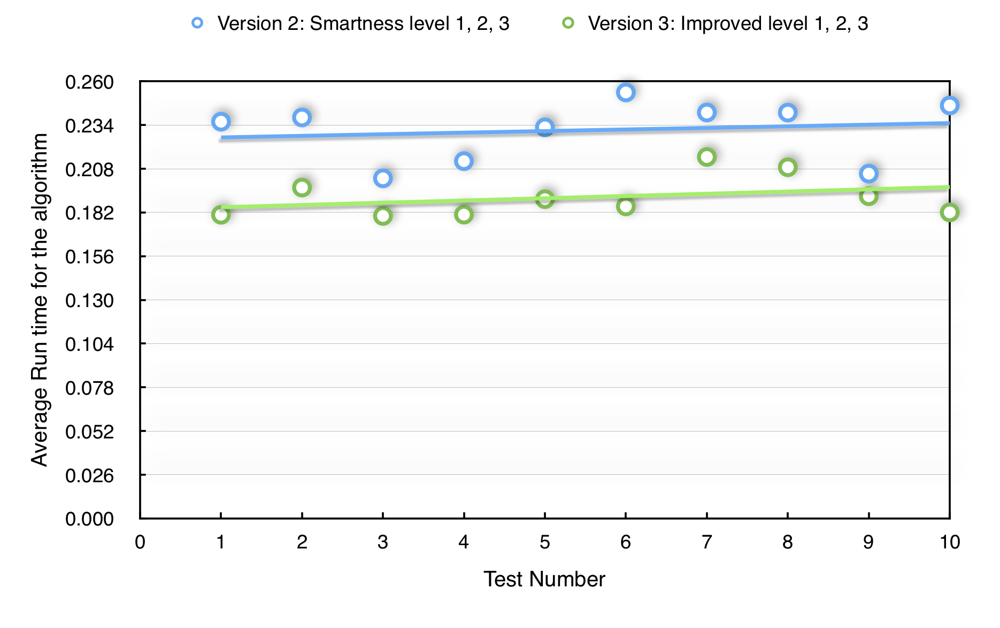{:class="img-responsive centered" height="80%" width="80%"}

Finally, we also evaluate a traditional greedy algorithm based on the Grid World MDP. Surprisingly, our algorithm runs more than 100 times faster than the traditional solution.

In order to visualize the abilities of our algorithms, we run 10 times for each of our algorithms including:
##### Level 1: Immediate decision
##### Level 2: Two steps decision
##### Level 3 (Navigating to best point ) combined with level 1 and 2
##### Grid World MDP greedy algorithm
##### improved level 1, 2, 3

#### Running time of level 1 is significantly faster than level 2

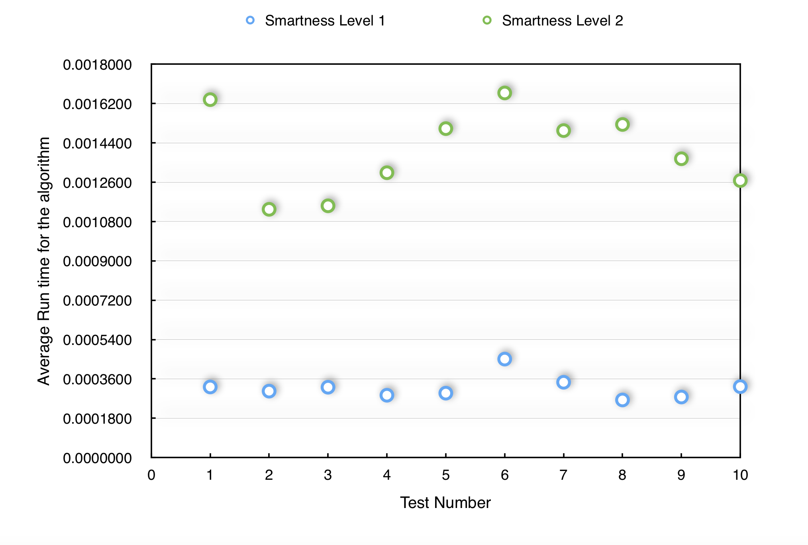{:class="img-responsive centered" height="80%" width="80%"}

#### Running time of level 2 is significantly faster than level 3

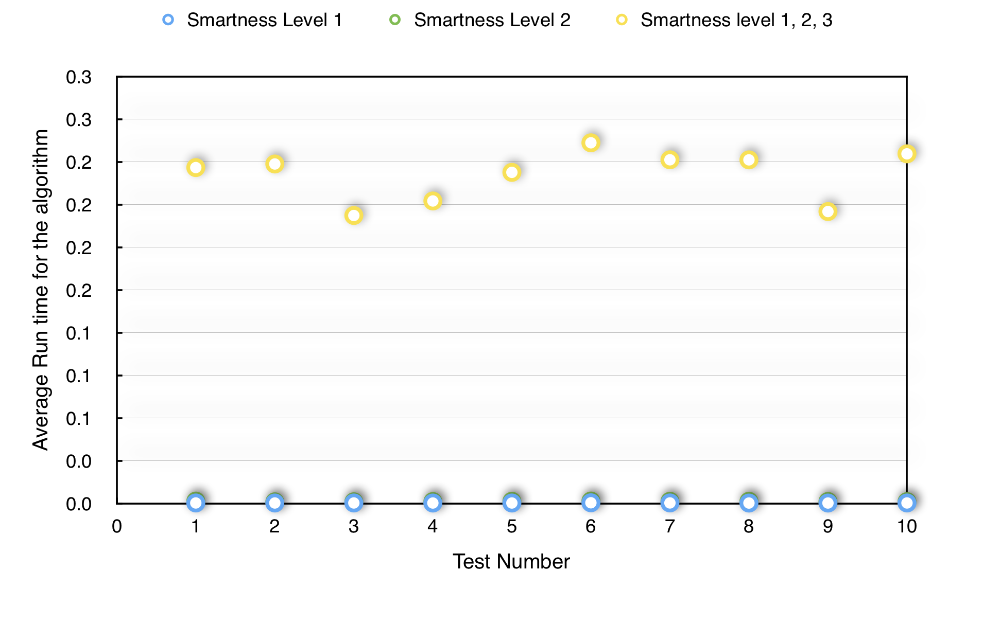{:class="img-responsive centered" height="80%" width="80%"}

#### Running time of level 3 is significantly faster than greedy algorithm

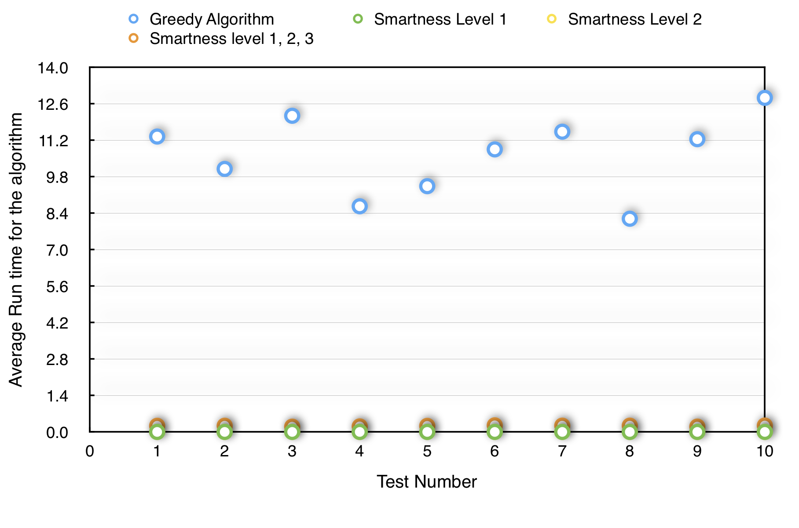{:class="img-responsive centered" height="80%" width="80%"}

#### We log the original data to give a better visualization for the running time 

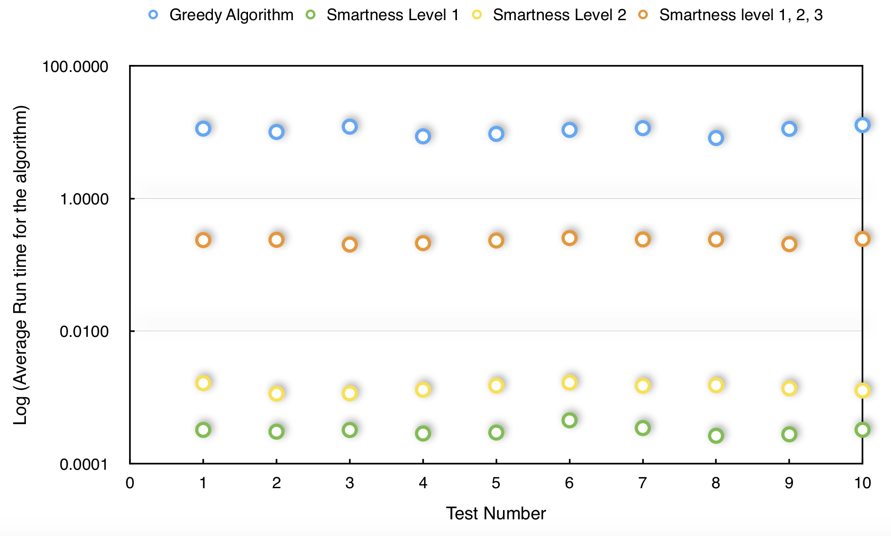{:class="img-responsive centered" height="80%" width="80%"}

#### In the end, we record the survial time for each of our algorithm

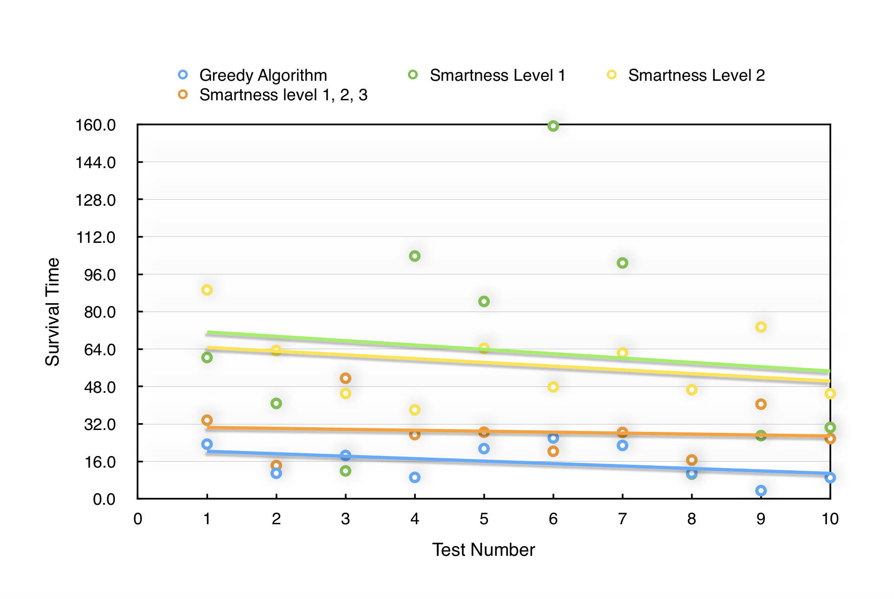{:class="img-responsive centered" height="80%" width="80%"}
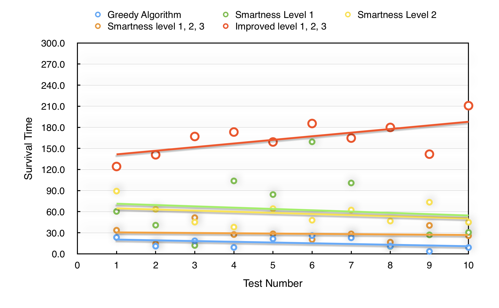{:class="img-responsive centered" height="80%" width="80%"}

## References

Fridenfalk, M. (2014) N-Person Minimax and Alpha-Beta Pruning. In: NICOGRAPH International 2014 (pp. 43-52).
